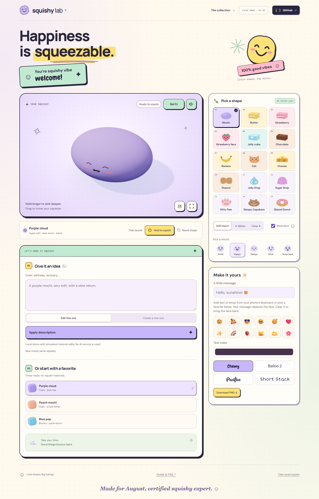
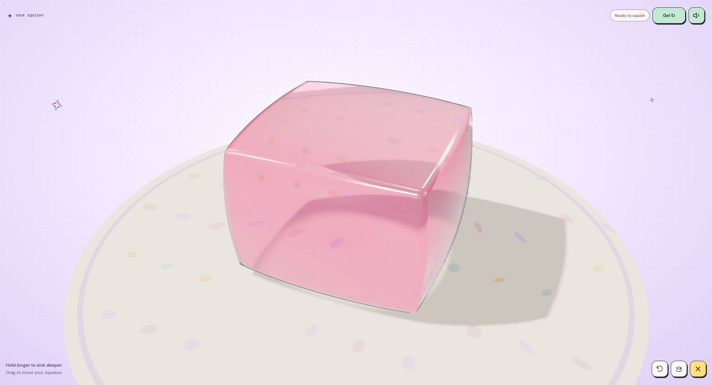
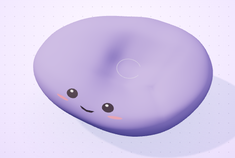

# Squishy Lab

[](https://github.com/Daniele-Cangi/squishy-lab/actions/workflows/ci.yml)
[](https://github.com/Daniele-Cangi/squishy-lab/releases)
[](LICENSE)
[](https://www.squishylab.fun/)

**Happiness is squeezable.** A playful 3D squishy playground with soft-body deformation, cute personalization, recorded sound textures and optional AI material editing.

**Live website: [https://www.squishylab.fun/](https://www.squishylab.fun/)**

Pick a shape, press and hold to sink deeper, then release and watch it recover. Make it yours with a little message, emoji, a cute font and your favorite text color, and download a PNG of your creation.



## Features

- **15 collection entries:** Mochi, Butter, Strawberry bar, Strawberry face, Jelly cube, Chocolate, Banana, Cat, Cheese, Peanut, Jelly Drop, Sugar Drop, Kitty Paw, Sleepy Capybara and Glazed Donut. Fourteen underlying body geometries include curved silhouettes, raised paw pads, a broad capybara muzzle, fine candy grain and a donut with a genuine center hole, icing and sprinkles.
- **Soft-body interaction:** press, hold or drag with a mouse or touch. Longer holds deepen and widen the dent. Keyboard controls, reset and rotation are included.
- **Finishes and faces:** Soft touch, Glitter and Clear, plus Smile, Happy, Sleepy, Wink and Surprised expressions. Surface details follow the deforming geometry.
- **Make it yours:** a short message, four locally hosted fonts (Chewy, Baloo 2, Pacifico and Short Stack), and a text color picker. Your message replaces the face; clearing it restores the selected expression. Personalization persists across collection changes and reloads.
- **Emoji personalization:** use your phone's emoji keyboard, paste emoji, or tap one of 12 quick picks. Mix emoji with text; quick picks insert at the cursor or replace selected text. Emoji count toward the message length limit. Their appearance follows the device's available fonts and may vary across platforms; color emoji retain their own colors when you change the text color.
- **Download PNG:** save the current rendered squishy, including its text and emoji, without the page's controls or panels.
- **Gel and Crunchy audio:** pressure-responsive excerpts from real recordings. Gel is selected and enabled by default, starting after the first playground gesture as required by browsers. Choose Crunchy or mute with the speaker button.
- **Responsive playground:** a large squishy with the AI panel below it on the left, and collection/customization controls on the right on desktop. On mobile, the squishy stays above the controls and AI is the last panel. Fullscreen uses the browser API or a viewport fallback.
- **Optional AI material edits:** describe color, softness, firmness, recovery or proportions in English. The public app uses Cloudflare Workers AI; local development uses an explicit mock. AI does not generate new shapes, text or fonts.
- **Before/after comparison:** compare an edited material under the same automated squeeze and recovery gesture.

**Visitor sticker:** “You’re squishy vibe no. …” assigns one visit number per browser every 24 hours. Refreshing keeps the same number. The persistent counter starts from its launch and is separate from Vercel Web Analytics. A random token is saved locally for 24 hours; clearing browser storage or changing browsers counts again.

Vercel Web Analytics is enabled in production. Analytics URLs exclude query strings.

The official domain is **[www.squishylab.fun](https://www.squishylab.fun/)**. Vite renders the playground HTML at build time. Instructions and FAQs have their own [guide page](https://www.squishylab.fun/guide/), linked from the footer and readable without JavaScript. Search metadata, structured application data, robots rules, a sitemap and an optional AI-readable summary use the same canonical domain. See [SEO and indexing](docs/SEO.md) for verification and maintenance.

The interface uses English throughout. Optional material and appearance settings are saved locally; prompts are not saved.

## Run locally

```sh
git clone https://github.com/Daniele-Cangi/squishy-lab.git
cd squishy-lab
npm ci
npm run dev
```

Open **http://127.0.0.1:5173**. Use Node **22.13+ on the 22.x line, or 24+**, and a browser supporting WebGL 2. Node 22.19.0 and npm 11.6.2 were tested on Windows. Blender is needed only for asset authoring.

Local development displays **Local demo · no AI** and uses a limited, deterministic description interpreter. Try:

- `A purple mochi, very soft, with a slow return.`
- `Same, but a little firmer.`
- `Keep the color and make it recover faster.`
- `Make it flatter.`

Hold **Space/Enter** while the canvas or **Hold to squish** control is focused. Release to recover. **Escape** resets the canvas, or exits fullscreen when expanded. **Rotate view** changes the camera; **Reset shape** restores the current material. The footer's **Clear saved squishy** removes saved material and appearance settings.

## AI and deployment

The public site is hosted on **Vercel**, with a same-origin gateway to a private **Cloudflare Worker** using `@cf/qwen/qwen3-30b-a3b-fp8`. Genuine Turnstile verification protects AI requests.

```text
English description + optional current material
  → Vercel gateway → private Cloudflare Worker → Workers AI
  → validated material patch → deterministic compiler
  → local physics cage + embedded Three.js surface
```

The model returns bounded material data, never executable code, shaders or meshes. A request has at most one repair within its timeout budget. Presets, squishing, personalization, PNG downloads and sound do not use AI.

The public AI allowance is **3 verified requests per public IP in a rolling 24-hour window**, persisted with a Cloudflare Durable Object. Each slot expires 24 hours after use; devices sharing an IP share the allowance. Requests that begin inference count even if unsupported, cancelled or unsuccessful. Invalid requests and failed verification do not consume a slot. Minute rate limits also apply. No login is required.

For opt-in local live inference, authenticate using `npx wrangler login` and run `npm run dev:ai`, then open **http://127.0.0.1:5174**. This separate adapter keeps credentials server-side and caps the evaluation session at 12 model calls. Read the setup documents before enabling it.

- [Cloudflare setup and model evaluation](docs/CLOUDFLARE.md)
- [Vercel production configuration and daily quota](docs/VERCEL.md)
- [Verification and recorded evidence](docs/VERIFICATION.md)

## How it works

Solid forms use a **216-particle / 750-tetrahedron CPU cage** with XPBD distance and volume constraints and a welded **5,402-vertex visual surface**. The donut uses a separate periodic ring cage with **256 particles / 864 tetrahedra** and **3,600 surface vertices**; no physical cells or skin triangles fill its hole. Lettering and decorations follow the respective deforming surface. Physics runs at a fixed 120 Hz with bounded catch-up, supports, inversion barriers and rejected unsafe steps.

Pressure ramps over 0.85 seconds. Sustained holds progressively deepen and widen the contact until second six; dragging moves the contact and adds depth. No hardware pressure sensor is required. The simulation is a tuned toy material, not a calibrated engineering model; arbitrary self-collision is not implemented and only one pointer deforms the object.



*Clear Jelly cube after an AI color-only edit to coral pink; shape and material are preserved.*



`src/shared/` contains the spec, compiler and AI contract. `src/physics/` is independent of rendering and hosting. `src/scene.ts` handles rendering and interaction; `src/decorations.ts` binds details and custom lettering to the surface. `src/sound.ts` manages recorded audio. `server/` and `worker/` implement the API gateway and provider.

## Blender workshop

The [editable workshop](assets/blender/squishy-collection.blend) contains named reference skins, print meshes and hidden cage references. The browser consumes `public/assets/collection-details.json`; it does not require Blender at runtime.

```sh
npx tsx scripts/export-workshop.ts
blender -b --factory-startup --python scripts/blender-collection.py
```

Blender 5.2.2 LTS was tested. The authoring script uses installed Arial Bold when available, otherwise Blender's built-in font. Shapes and generic product lettering are original geometry inspired by familiar squishy silhouettes, without brand affiliation.

See [collection notes](docs/COLLECTION.md), [design notes](docs/DESIGN.md) and [deformation notes](docs/TECHNICAL-NOTES.md).

## Checks

```sh
npm run check                    # typecheck, lint, unit tests, production build
npx playwright install chromium # install the browser if needed
npm run test:browser             # interaction, API, mobile, fullscreen and downloads
npm run evaluate:ai              # explicit MOCK evaluation; no remote inference
npm run measure:physics          # numerical deformation and recovery traces
npm run measure:surface          # rendered-surface indentation profiles
npm run worker:check             # local Worker bundle/dry run; does not publish
```

GitHub Actions runs checks and browser tests on Linux using software rendering. CI does not deploy or call live AI. Vercel's Git integration publishes the frontend separately. Browser viewport emulation is not a physical iPhone test. Historical AI campaigns and numerical recordings are documented in the [verification report](docs/VERIFICATION.md).

## Privacy and licensing

Manipulation and presets run locally after loading. Audio loads on demand; custom lettering fonts are bundled locally. Interface typography uses Google Fonts with system fallbacks. There is no guaranteed offline restart or service worker.

Live descriptions are sent to Cloudflare Workers AI. Do not include personal information. Prompts and raw IP addresses are not logged by the application. Turnstile uses the IP transiently; the daily quota stores timestamps keyed by an HMAC-derived IP identifier. Optional settings stay in the browser. No user accounts or prompt history are implemented.

Application code is [MIT licensed](LICENSE). Audio and fonts have separate licenses:

- Gel and Crunchy recordings: [sources, adaptations and Pixabay licensing](docs/AUDIO-LICENSE.md).
- Chewy: Apache 2.0; Baloo 2, Pacifico and Short Stack: SIL Open Font License. License files are included in [public/fonts](public/fonts/).
- Three.js and other dependencies retain their own licenses.
- Qwen3 model weights remain on the provider; the [model repository](https://huggingface.co/Qwen/Qwen3-30B-A3B-FP8) declares Apache 2.0. Historical Llama candidates have their own Llama Community Licenses.

The solver follows the [XPBD paper](https://mmacklin.com/xpbd.pdf) and the physical/visual separation demonstrated in [Ten Minute Physics](https://matthias-research.github.io/pages/tenMinutePhysics/). Delay state and the semantic compiler are application-specific approximations.

---

*Made for August, certified squishy expert. ☺*
