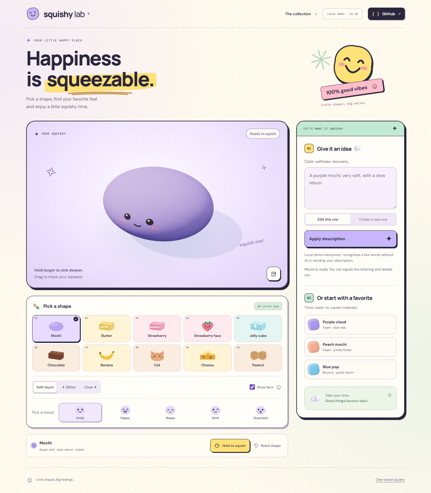

# Squishy Lab

A small, playable 3D material lab. Choose a mochi, printed Butter or Strawberry bar, smiling strawberry, clear Jelly cube, chocolate bar, curved banana, cat, cheese wedge or peanut. Hold a dent, release it, and watch the foam slowly rise. Describe a different color or feel, then compare it under the same gesture.

**[Play online](https://squishy-lab-phi.vercel.app)** — hosted in [daniele-cangis-projects on Vercel](https://vercel.com/daniele-cangis-projects/squishy-lab), with real Cloudflare Workers AI. The page, examples, status messages and verification widget use English. Mochi starts with a smile; choose Smile, Happy, Sleepy, Wink or Surprised without resetting your squeeze. Transparent objects sit on a cream tray with pastel confetti and a lavender rim.

**Try it locally, without an AI account:**

```sh
git clone https://github.com/Daniele-Cangi/squishy-lab.git
cd squishy-lab
npm ci
npm run dev
```

Open **http://127.0.0.1:5173**. Node 22.19.0 / npm 11.6.2 were tested on Windows. Use Node 22.13+ or 24+. WebGL 2 is required. No weights, Blender, Docker, database, or local inference are needed.

The page immediately shows a local preset. The **Local demo · no AI** description interpreter is a deliberately limited fixture provider, not simulated AI inference. Try:

- `A purple mochi, very soft, with a slow return.`
- `Same, but a little firmer.`
- `Keep the color and make it recover faster.`
- `Make it flatter.`
- `A yellow mochi, very firm.`

Hold the object to increase pressure over 0.85 seconds. After the first second, a stationary hold progressively deepens and widens the dent until second six; drag to move the contact and drag down to add depth. Pressure does not depend on hardware pressure sensors. Hold **Space/Enter** on the canvas or on **Hold to squish**; release to recover. **Escape** on the canvas and **Reset shape** restore the current material's shape. **Rotate view** is separate from deformation. The final footer action removes the optional saved spec. Prompts are never saved.

The thin COCOA bar spreads upper-surface pressure into a broader dent, including between simulation nodes, while retaining the horizontal side response. See the [pressure measurements and browser captures](docs/VERIFICATION.md#chocolate-upper-surface-pressure).

After a material edit, **Compare before and after** repeats a two-second press and five-second recovery on both materials. Shape, color, finish, camera and gesture are held equal; deformation memory is reset between phases. Stop the comparison or press the object to return to the actual edited squishy. Descriptions of changes come from the applied parameters.



The page pairs a warm dotted background with lavender, mint and yellow panels, original smiling vector graphics, sticker accents and a compact GitHub source link. The responsive collection and composer share the same visual language; see the [design notes and mobile captures](docs/DESIGN.md).

## What is implemented

- Ten local collection entries using nine coherent body geometries. Chocolate has six raised squares; the banana has a rounded curved body, extended stem, brown end and peel markings; the cat has integral soft ears and an optional muzzle; the cheese wedge has actual recessed pockets; the peanut has two unequal rounded lobes, a narrow waist, shell grain and a seam. Blender-authored details and lettering follow the actual deforming render triangles. All entries support soft-touch, glitter and refractive transparency. Three local material presets remain available.
- A 216-particle / 750-tetrahedron CPU cage with XPBD distance and volume constraints; a welded 5,402-vertex visual surface follows the cage. Local dents, material-dependent bulging, dissipated motion and per-particle delayed deformation, with an immutable reference.
- Fixed 120 Hz physics, bounded catch-up, floor/support, inversion barriers and rejected unsafe steps. Mouse/touch pointer capture, cancellation, outside release and keyboard control.
- A versioned data-only spec and contextual patch contract, deterministic compiler, strict server validation and defensive client validation. A shape change swaps the entire cage and embedding atomically; color/finish changes retain deformation.
- `POST /api/squishy`, explicit local mock, Cloudflare Workers AI binding adapter, one repair at most, quota/rate/timeout/unavailable states, stale-response protection and an object that stays interactive while a request runs or the network fails.
- Cloudflare Static Assets configuration, server-validated Turnstile, Workers rate-limiting bindings, tests, essential CI and recorded evidence.

**The real phrase → model → material loop is verified.** Llama 3B and 8B had semantic misses, so the selected model is **Qwen3-30B-A3B-FP8**, on the same Cloudflare Workers AI service. Its last full campaign passed 26/26; separate paraphrase regressions passed 8/8 and 5/5, with one bounded repair in the last set. The initial unseen run had a recovery-direction miss, preserved in the history. A later user report exposed an Italian “molto duro” interpretation miss, even without a typo: clarified firmness vocabulary passes six targeted live cases and three prior smoke cases. Historical real-browser A/B evidence shows lower indentation after “meno molle.” The Vercel release now uses a deployed private Worker, genuine Turnstile verification and the existing rate limits; a public English material edit has been verified. See [verification](docs/VERIFICATION.md) and [production setup](docs/VERCEL.md).

For an intentional live local session, authenticate with `npx wrangler login`, keep Workers Free, and run `npm run dev:ai`. Open **http://127.0.0.1:5174**. This separate loopback adapter uses real inference, keeps credentials in the Node process and caps the session at 12 model calls. If subscription access returns 403, the documented Free-plan confirmation flag is required; see [Cloudflare setup](docs/CLOUDFLARE.md). Ordinary development and CI remain explicitly mock.

## Local collection and Blender workshop

Use **Pick a shape**, then choose **Soft touch**, **Glitter** or **Clear** and optionally **Show face**. **Pick a mood** selects five Blender-authored expressions for Mochi, Strawberry face and Cat, with the cat's nose and whiskers retained. Selecting a collection entry sets its silhouette, print and base color while retaining your material parameters. Changing an effect or face retains the current dent. Reload restores both material and local appearance; old saved appearances remain readable. The footer clears both. The AI continues to use its unchanged v1 material contract. It does not generate these assets or interpret the local collection controls.

Open [the editable Blender workshop](assets/blender/squishy-collection.blend). It contains ten separately named collections in two rows, editable reference skin meshes, print meshes, and hidden cage references. The browser uses the generated triangle library in `public/assets/collection-details.json`; Blender is only needed for authoring. The runtime body and cage use the same shape map. Workshop details sample the exported runtime triangles and normals exactly, including curved silhouettes and cheese recesses.

Rebuild from the repository root (Blender 5.2.2 LTS tested):

```sh
npx tsx scripts/export-workshop.ts
blender -b --factory-startup --python scripts/blender-collection.py
```

On this Windows machine the executable is `E:\blender.exe`. The script uses installed Arial Bold when present, otherwise Blender's built-in font. Fonts and product photos are not bundled. These are original geometry and generic lettering inspired by commercially familiar squishy silhouettes, with no claim of brand affiliation. See [collection implementation and evidence](docs/COLLECTION.md).

## Checks and evidence

```sh
npm run check           # strict typecheck, lint, unit tests, production build
npx playwright install chromium  # only if Chromium is not already installed
npm run test:browser    # browser smoke + interaction/API/error flows; software rendering
npm run evaluate:ai     # 26 synthetic cases, explicitly MOCK; zero remote calls
npm run measure:physics # numerical traces, recovery, 12 cycles, 30/60/144 Hz comparison
npm run measure:surface # persistent rendered-surface probes and indentation profiles
npm run measure:chocolate # top-center/tile/off-center and side depths against retained baseline
npm run record:chocolate # normal-time Chrome upper-surface mouse hold and recovery
npm run record:experience # normal-time Chrome press/release/drag video
npm run record:collection -- --expanded # new five shapes, press/recovery, effects, mobile
npx tsx scripts/record-shape-refinement.ts # real mouse short/long holds, revised banana/peanut
npx tsx scripts/record-interface.ts # current desktop/mobile theme, forms and composer focus
npm run measure:browser # requires npm run dev + installed Chrome; records actual GPU
npm run worker:check    # local bundle/dry run; does not publish
npm run worker:dev      # local workerd preview of built assets + MOCK, normally port 8787
```

See [verification report](docs/VERIFICATION.md), [deformation notes](docs/TECHNICAL-NOTES.md), [deployment instructions](docs/CLOUDFLARE.md), [revised shapes and long-hold recording](evidence/shape-refinement/shape-refinement.webm), [recorded contact depths](evidence/shape-refinement/shape-refinement.json), [historical physics CSV](evidence/refined/physics.csv), [surface profiles](evidence/refined/surface.json), [live semantic results](evidence/refined/ai-live-qwen-corpus.json), [normal-time video](evidence/refined/experience.webm), [real AI comparison video](evidence/refined/ai-live-browser.webm), and [performance sample](evidence/refined/browser-performance.json). The prior physics traces use gesture v2; the progressive hold is v3. The original root evidence and the recorded `baseline-b169dc8` remain intact. Browser smoke screenshots live in `evidence/refined/browser-smoke/`.

The GitHub Actions workflow runs checks and Chromium smoke on Linux. It does not deploy or run live inference. Current remote results are available in [GitHub Actions](https://github.com/Daniele-Cangi/squishy-lab/actions/workflows/ci.yml); the measurements in the verification report were collected locally.

The optional browser benchmark uses installed Chrome. To measure bundled Chromium instead, set `SQUISHY_BROWSER_CHANNEL=chromium` (PowerShell: `$env:SQUISHY_BROWSER_CHANNEL='chromium'`). The report records the selected GPU; SwiftShader results are software smoke measurements, not phone or hardware performance claims.

## Architecture and AI's concrete role

```text
description + optional current spec
  → Vercel same-origin gateway → private Cloudflare Worker
  → bounded remote open-weight model call
  → validated semantic patch → validated SquishySpec v1
  → deterministic material/geometry compiler
  → local cage + embedded Three.js surface → browser interaction
```

The model chooses semantic material data; it never supplies code, shaders, meshes, asset URLs or physics updates. Modifications send only the latest spec as compact context, not a persistent conversation. Omitted patch fields are preserved by construction and checked on the client. Preserving *requested meaning* is separately evaluated by the synthetic corpus: valid JSON alone is insufficient.

`src/shared/` is the portable contract/compiler/prompt. `src/physics/` has no renderer, browser or hosting dependency. `src/scene.ts` owns rendering and pointer mapping. `worker/` is a small hosting/provider adapter, independent of Vite. Vite's development-only middleware calls the same API handler with the explicit mock. The frontend can be served elsewhere with a same-origin `/api` proxy; cross-origin requests are intentionally refused. A static-only preview retains presets and manipulation, and reports that the description service is unavailable.

The initial `@cf/meta/llama-3.2-3b-instruct` uses prompted JSON; `@cf/meta/llama-3.1-8b-instruct` uses documented JSON Schema mode. Live comparisons favored `@cf/qwen/qwen3-30b-a3b-fp8`, a mixture-of-experts model with about 3.3B active parameters and the same listed neuron rates as the initial 3B. Its documented non-thinking chat template keeps generation within 420 output tokens. Explicit protection checks reject recognized protected-field edits and contradictory recovery directions; they never invent a patch or substitute a mock. One repair shares the original 18-second budget. There is no automatic model/provider failover. See [Cloudflare instructions](docs/CLOUDFLARE.md).

## Limits, privacy and costs

This is a tuned toy foam, not a calibrated engineering material. Recovery is an operational 90% target for a standard press, not a physical constant. Very long holds creep further; arbitrary self-collision is not implemented. Proportions and compression are bounded; no promises are made outside the tested domain. Only one pointer deforms the object. There are no accounts, audio, social features or prompt history.

After loading, manipulation and presets need no network. There is no service worker or guaranteed offline restart. Optional fonts use Google Fonts with a system-font fallback. Live descriptions go to Cloudflare Workers AI; the UI says so and asks users not to include personal data. Worker observability is off; the application does not log prompts, conversations, IP addresses or child information. Turnstile validation uses an IP transiently and rate limits use the edge-provided IP as an unlogged key.

The prepared configuration defaults to **AI disabled**. Cloudflare's Workers AI documentation, checked on **3 October 2026**, gives a Free allocation of **10,000 neurons/day**, resetting at 00:00 UTC, with further operations failing after the allowance. Request costs depend on input/output tokens and the model, and a repair can double the calls. Keep the account on Workers Free; do not enable Paid or prepaid credits. Turnstile offers a Free plan. Endpoint rate limits are per Cloudflare location and eventually consistent, not a global accounting limit; the Free provider quota is the final daily stop. No paid services were activated. The Free plan was confirmed by the user because the subscription API returned 403; real inference returned usage metadata.

## Licenses and attribution

Our application code is under [MIT](LICENSE). Three.js is MIT; dependencies retain their own licenses. No model weights or third-party sample code are bundled. Meta's Llama 3.2 / 3.1 models use their respective **Llama Community Licenses**, separately from this code's MIT license; they are described here as **open-weight**, not as OSI-licensed open-source weights. Review the model terms before publication. If the remote model is enabled, attribution is also shown in the interface.

The selected [Qwen3 FP8 model](https://huggingface.co/Qwen/Qwen3-30B-A3B-FP8) declares Apache-2.0. Its weights remain on the provider; the UI displays Qwen attribution when that model is selected.

The independently written solver follows the XPBD method described by Macklin, Müller and Chentanez, and the physical/visual mesh separation demonstrated by Matthias Müller. The delay-state and semantic compiler are application-specific approximations. Sources:

- [XPBD paper](https://mmacklin.com/xpbd.pdf), [Ten Minute Physics, tutorials 10 and 12](https://matthias-research.github.io/pages/tenMinutePhysics/).
- [Three.js documentation](https://threejs.org/docs/).
- [Workers Static Assets](https://developers.cloudflare.com/workers/static-assets/), [Workers AI pricing](https://developers.cloudflare.com/workers-ai/platform/pricing/), [3B candidate](https://developers.cloudflare.com/workers-ai/models/llama-3.2-3b-instruct/), [JSON Mode](https://developers.cloudflare.com/workers-ai/features/json-mode/).
- [Turnstile Free plan](https://developers.cloudflare.com/turnstile/plans/), [server validation](https://developers.cloudflare.com/turnstile/get-started/server-side-validation/), [rate-limiting binding and accuracy](https://developers.cloudflare.com/workers/runtime-apis/bindings/rate-limit/).
- [Meta Llama 3.2 license](https://github.com/meta-llama/llama-models/blob/main/models/llama3_2/LICENSE), [Meta Llama 3.1 license](https://github.com/meta-llama/llama-models/blob/main/models/llama3_1/LICENSE).

## Challenge context

The [official DEV challenge](https://dev.to/challenges/hacktoberfest-weekend-2026-10-01), checked again before source publication on 3 October 2026, states **5 October 2026, 06:59 UTC**, which is **08:59 Europe/Copenhagen** and **08:59 Europe/Paris**. Recheck the rules and eligibility immediately before any submission. Squishy Lab is a working name. Git history records this delivery without backdating; future changes after the deadline should be identified separately. The repository is published with the user's authorization; no DEV article has been submitted, and no feedback from the child is claimed.
