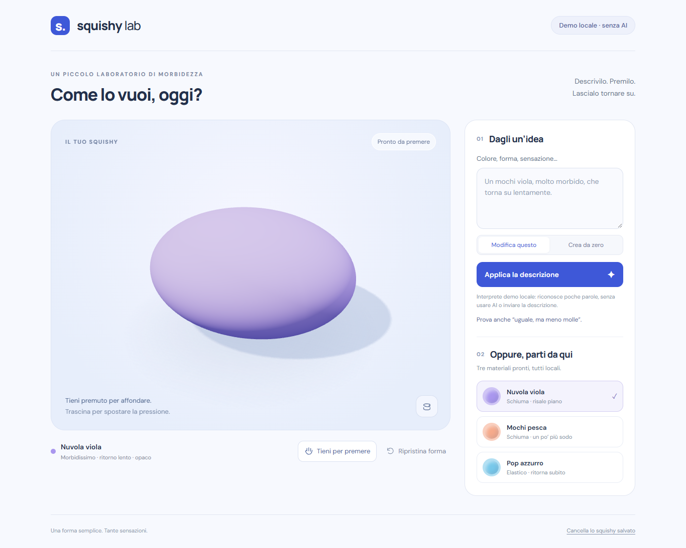

# Squishy Lab

A small, playable 3D material lab. Press a rounded mochi, hold a dent, release it, and watch the foam slowly rise. Describe a different color or feel, then compare it under the same gesture.

**Try it locally, without an AI account:**

```sh
git clone https://github.com/Daniele-Cangi/squishy-lab.git
cd squishy-lab
npm ci
npm run dev
```

Open **http://127.0.0.1:5173**. Node 22.19.0 / npm 11.6.2 were tested on Windows. Use Node 22.13+ or 24+. WebGL 2 is required. No weights, Blender, Docker, database, or local inference are needed.

The page immediately shows a local preset. The **Demo locale · senza AI** description interpreter is a deliberately limited fixture provider, not simulated AI inference. Try:

- `Fammi un mochi viola, molto morbido, che torna su lentamente.`
- `Uguale, ma meno molle.`
- `Non cambiare colore: fallo riprendere più velocemente.`
- `Lo voglio più schiacciato, non più piccolo.`

Hold the object to increase pressure over 0.85 seconds; drag to move the contact and drag down to add depth. Pressure does not depend on hardware pressure sensors. Hold **Space/Enter** on the canvas or on **Tieni per premere**; release to recover. **Escape** on the canvas and **Ripristina forma** restore the current material's shape. **Ruota la vista** is separate from deformation. The final footer action removes the optional saved spec. Prompts are never saved.



## What is implemented

- One honest procedural archetype: a rounded, volume-normalized mochi/blob. Three local material presets, including an elastic comparison. No animal catalog, holes or imported meshes.
- A 216-particle / 750-tetrahedron CPU cage with XPBD distance and volume constraints; a welded 5,402-vertex visual surface follows the cage. Local dents, material-dependent bulging, dissipated motion and per-particle delayed deformation, with an immutable reference.
- Fixed 120 Hz physics, bounded catch-up, floor/support, inversion barriers and rejected unsafe steps. Mouse/touch pointer capture, cancellation, outside release and keyboard control.
- A versioned data-only spec and contextual patch contract, deterministic compiler, strict server validation and defensive client validation. A shape change swaps the entire cage and embedding atomically; color/finish changes retain deformation.
- `POST /api/squishy`, explicit local mock, Cloudflare Workers AI binding adapter, one repair at most, quota/rate/timeout/unavailable states, stale-response protection and an object that stays interactive while a request runs or the network fails.
- Cloudflare Static Assets configuration, server-validated Turnstile, Workers rate-limiting bindings, tests, essential CI and recorded evidence.

**Live AI inference has not been verified.** No Cloudflare credentials were available for this delivery. The remote adapter and evaluation harness are implemented; mock tests are not evidence of Llama's semantic understanding. Source publication to [GitHub](https://github.com/Daniele-Cangi/squishy-lab) was authorized on 3 October 2026. Cloudflare deployment and DEV submission have not been performed, and no paid resources have been activated.

## Checks and evidence

```sh
npm run check           # strict typecheck, lint, 62 unit tests, production build
npx playwright install chromium  # only if Chromium is not already installed
npm run test:browser    # browser smoke + interaction/API/error flows; software rendering
npm run evaluate:ai     # 26 synthetic cases, explicitly MOCK; zero remote calls
npm run measure:physics # numerical traces, recovery, 12 cycles, 30/60/144 Hz comparison
npm run measure:browser # requires npm run dev + installed Chrome; records actual GPU
npm run worker:check    # local bundle/dry run; does not publish
npm run worker:dev      # local workerd preview of built assets + MOCK, normally port 8787
```

See [verification report](docs/VERIFICATION.md), [deformation notes](docs/TECHNICAL-NOTES.md), [deployment instructions](docs/CLOUDFLARE.md), [physics CSV](evidence/physics.csv), [physics JSON](evidence/physics.json), [mock semantic report](evidence/ai-mock.json), and [performance sample](evidence/browser-performance.json). Browser screenshots include rest, compression, recovery, mobile and a **mock** before/after material edit. A remote AI before/after is deliberately absent.

The GitHub Actions workflow runs checks and Chromium smoke on Linux. It does not deploy or run live inference. Current remote results are available in [GitHub Actions](https://github.com/Daniele-Cangi/squishy-lab/actions/workflows/ci.yml); the measurements in the verification report were collected locally.

The optional browser benchmark uses installed Chrome. To measure bundled Chromium instead, set `SQUISHY_BROWSER_CHANNEL=chromium` (PowerShell: `$env:SQUISHY_BROWSER_CHANNEL='chromium'`). The report records the selected GPU; SwiftShader results are software smoke measurements, not phone or hardware performance claims.

## Architecture and AI's concrete role

```text
description + optional current spec
  → same-origin Worker → bounded remote open-weight model call
  → validated semantic patch → validated SquishySpec v1
  → deterministic material/geometry compiler
  → local cage + embedded Three.js surface → browser interaction
```

The model chooses semantic material data; it never supplies code, shaders, meshes, asset URLs or physics updates. Modifications send only the latest spec as compact context, not a persistent conversation. Omitted patch fields are preserved by construction and checked on the client. Preserving *requested meaning* is separately evaluated by the synthetic corpus: valid JSON alone is insufficient.

`src/shared/` is the portable contract/compiler/prompt. `src/physics/` has no renderer, browser or hosting dependency. `src/scene.ts` owns rendering and pointer mapping. `worker/` is a small hosting/provider adapter, independent of Vite. Vite's development-only middleware calls the same API handler with the explicit mock. The frontend can be served elsewhere with a same-origin `/api` proxy; cross-origin requests are intentionally refused. A static-only preview retains presets and manipulation, and reports that the description service is unavailable.

The candidate is `@cf/meta/llama-3.2-3b-instruct`, using compact prompted JSON. Cloudflare's model page exposes a response-format parameter, but its current JSON Mode supported-model list does not include that model. We therefore do not assume schema-constrained generation on the 3B. An intentionally selectable alternative, `@cf/meta/llama-3.1-8b-instruct`, uses documented JSON Schema mode. Neither has been declared the semantic winner without live measurements. See the comparison procedure in [Cloudflare instructions](docs/CLOUDFLARE.md).

## Limits, privacy and costs

This is a tuned toy foam, not a calibrated engineering material. Recovery is an operational 90% target for a standard press, not a physical constant. Very long holds creep further; arbitrary self-collision is not implemented. Proportions and compression are bounded; no promises are made outside the tested domain. Only one pointer deforms the object. There are no accounts, audio, social features or prompt history.

After loading, manipulation and presets need no network. There is no service worker or guaranteed offline restart. Optional fonts use Google Fonts with a system-font fallback. Live descriptions go to Cloudflare Workers AI; the UI says so and asks users not to include personal data. Worker observability is off; the application does not log prompts, conversations, IP addresses or child information. Turnstile validation uses an IP transiently and rate limits use the edge-provided IP as an unlogged key.

The prepared configuration defaults to **AI disabled**. Cloudflare's Workers AI documentation, checked on **3 October 2026**, gives a Free allocation of **10,000 neurons/day**, resetting at 00:00 UTC, with further operations failing after the allowance. Request costs depend on input/output tokens and the model, and a repair can double the calls. Keep the account on Workers Free; do not enable Paid or prepaid credits. Turnstile offers a Free plan. Endpoint rate limits are per Cloudflare location and eventually consistent, not a global accounting limit; the Free provider quota is the final daily stop. No paid services are required or activated by this project. Availability on a real account remains to be checked.

## Licenses and attribution

Our application code is under [MIT](LICENSE). Three.js is MIT; dependencies retain their own licenses. No model weights or third-party sample code are bundled. Meta's Llama 3.2 / 3.1 models use their respective **Llama Community Licenses**, separately from this code's MIT license; they are described here as **open-weight**, not as OSI-licensed open-source weights. Review the model terms before publication. If the remote model is enabled, attribution is also shown in the interface.

The independently written solver follows the XPBD method described by Macklin, Müller and Chentanez, and the physical/visual mesh separation demonstrated by Matthias Müller. The delay-state and semantic compiler are application-specific approximations. Sources:

- [XPBD paper](https://mmacklin.com/xpbd.pdf), [Ten Minute Physics, tutorials 10 and 12](https://matthias-research.github.io/pages/tenMinutePhysics/).
- [Three.js documentation](https://threejs.org/docs/).
- [Workers Static Assets](https://developers.cloudflare.com/workers/static-assets/), [Workers AI pricing](https://developers.cloudflare.com/workers-ai/platform/pricing/), [3B candidate](https://developers.cloudflare.com/workers-ai/models/llama-3.2-3b-instruct/), [JSON Mode](https://developers.cloudflare.com/workers-ai/features/json-mode/).
- [Turnstile Free plan](https://developers.cloudflare.com/turnstile/plans/), [server validation](https://developers.cloudflare.com/turnstile/get-started/server-side-validation/), [rate-limiting binding and accuracy](https://developers.cloudflare.com/workers/runtime-apis/bindings/rate-limit/).
- [Meta Llama 3.2 license](https://github.com/meta-llama/llama-models/blob/main/models/llama3_2/LICENSE), [Meta Llama 3.1 license](https://github.com/meta-llama/llama-models/blob/main/models/llama3_1/LICENSE).

## Challenge context

The [official DEV challenge](https://dev.to/challenges/hacktoberfest-weekend-2026-10-01), checked again before source publication on 3 October 2026, states **5 October 2026, 06:59 UTC**, which is **08:59 Europe/Copenhagen** and **08:59 Europe/Paris**. Recheck the rules and eligibility immediately before any submission. Squishy Lab is a working name. Git history records this delivery without backdating; future changes after the deadline should be identified separately. The repository is published with the user's authorization; no DEV article has been submitted, and no feedback from the child is claimed.
